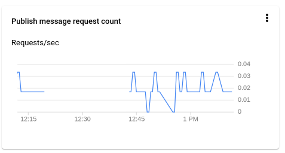
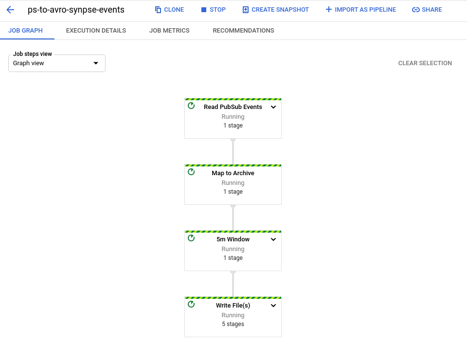

# GCP IoT Core Synpse example

GCP IoT Hub example contains IoT application example for GCP public cloud integration

Synpse is not competing with any of the Public Cloud offerings. Contrary - it adds value ontop.

Most public cloud providers gives users a framework to interact with their devices and consume their data.
It is very much `SAAS` layer product. Where `Synpse` allows you to manage devices in the lower layers, more like a `PAAS`.

Working together with public cloud offerings you can create bespoke architectures.

Cloud providers mostly provides "IoT hubs" for data ingestion and application layer interactions via MQTT. This allows 
application layer integration. For the embedded applications this is fine when application are part of hardware. But in the 
"age of containers" we are used to packaging application outside of hardware and iterate on both independently.

This is where Synpse comes in. It allows deploy and interact with your application as deployments. This way you can decouple your 
application logic from hardware.


## GCP IoT Core 

Configure GCP IoT Core create registry

1. Create pubsub topic
```
gcloud pubsub topics create synpse-events
```

2. Create GCP IoT registry:
```
gcloud iot registries create synpse-registry --region=us-central1 --enable-http-config --enable-mqtt-config --state-pubsub-topic projects/{project_id}/topics/synpse-events
```

3. Create storage event
```
gsutil mb -l us-central1 -b on gs://synpse-events
```

4. Create dataflow job
```
gcloud dataflow jobs run ps-to-avro-synpse-events --gcs-location gs://dataflow-templates-us-central1/latest/Cloud_PubSub_to_Avro --region us-central1 --staging-location gs://synpse-events/temp --parameters inputTopic=projects/iot-hub-326815/topics/synpse-events,outputDirectory=gs://synpse-events/events,avroTempDirectory=gs://synpse-events/avro-temp
```


5. Create a device
```
gcloud iot devices create synpse --region=us-central1 --registry=synpse-registry
```

6. Generate certificate for our device:
```
openssl ecparam -genkey -name prime256v1 -noout -out ec_private.pem
openssl ec -in ec_private.pem -pubout -out ec_public.pem
```

7. Add public key to GCP IoT Core
```
gcloud iot devices credentials create --region=us-central1 --registry=synpse-registry --device=synpse --path=ec_public.pem --type=es256
```


8. Download google root CA:
```
curl  https://pki.goog/roots.pem -o roots.pem
```

9. Test application

```
python gateway/gcp.py --device_id synpse --private_key_file ./ec_private.pem --cloud_region=us-central1 --registry_id synpse-registry --project_id iot-hub-326815 --algorithm ES256 --message_type state

```
# Deploy application

Deploy Synpse application. Modify application yaml with your thing endpoint.

1. Create certificate secret
```
synpse secret create gcp-cert -f ec_private.pem
synpse secret create gcp-root -f roots.pem
```

Deploy the application:
```
synpse deploy -f synpse-gcp-example.yaml
```





Once running, you should see application running and data coming into Azure storage account blob.


# WTF's

1. SDK is crazy with all these JWT retries and refresh, reconnects, etc. Google, you really can do better

2. CLI is decent, but your documentation of topic usages (status, events, config) is wow
